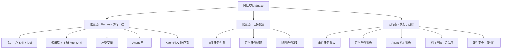
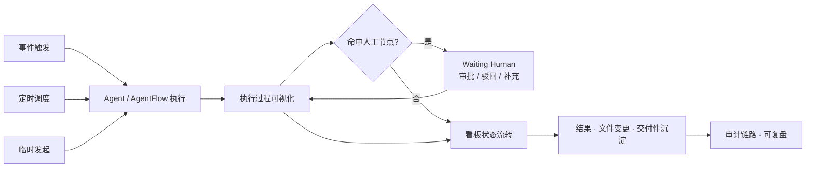

# AgentSpace 体验设计

> 把一个「团队级 Agent 工作系统」翻译成团队成员**看得懂、控得住、信得过、留得下**的日常工作界面。

🔗 **在线演示：** https://vinniechenyu.github.io/AgentSpace/

> ⚠️ 本仓库为产品原型（单文件 HTML Demo），用于交互与体验演示，数据均为示例。
> 本文从**体验设计**维度记录 AgentSpace 的设计命题、体验目标、信息架构与关键设计决策。内容基于产品定义文档（`product-definition.md`，内部文档）提炼。

---

## 1. 设计命题：复杂的系统，简单的使用

AgentSpace 的产品定位是 **「团队级 Agent 工作空间，用于配置、触发、监管和追踪 Agent 协同完成团队任务的全过程」**，目标是帮团队从「临时使用 Agent」升级为「配置和运营 Agent 工作系统」。

这个升级对体验设计提出了四个真实的张力：

| 系统的复杂性 | 对体验的挑战 |
| --- | --- |
| **双层对象模型**：配置态（怎么执行）与运行态（某一次执行）并存 | 用户要同时理解「我配了什么规则」和「现在跑成什么样」，心智容易错位 |
| **三类触发入口**：事件任务、定时任务、临时任务 | 入口语义不同、生命周期不同，却要收敛成一致的任务心智 |
| **人机协作**：Agent 自动执行，人只在关键节点介入（Human in the loop） | 既不能让人时刻盯屏，也不能让人错过该审批的节点——介入成本要低、信号要准 |
| **过程黑盒**：Agent 的思考、工具调用、文件变更不可见即不可信 | 自动化程度越高，越需要把过程「摊开」给人看，才敢把活交给它 |

> 体验设计的核心任务，就是把这套配置化、工程化的 Agent 系统，**降维成团队成员熟悉的「任务 — 看板 — 审批 — 交付」工作流**，让复杂留在系统里，简单留给用户。

---

## 2. 四个体验目标

围绕上面的命题，AgentSpace 的体验设计锚定四个目标：

- **可理解 Understandable** —— 配置态与运行态、三类任务、八种状态，都用团队成员熟悉的业务语言呈现，而非系统术语。
- **可掌控 Controllable** —— 在每个关键节点都给人「看、批、驳、补、停」的明确入口，人始终是流程的主人。
- **可信任 Trustworthy** —— Agent 的思考过程、工具调用、文件变更全程透明可见，自动化建立在可验证之上。
- **可沉淀 Accountable** —— 每一次执行都可追踪、可审计、可复盘，产出与变更沉淀为可治理的交付件。

---

## 3. 用户与场景

### 6 类角色，差异化体验

AgentSpace 面向 6 类角色，体验设计按「治理 → 配置 → 使用 → 旁观」的权限纵深分层：

| 角色 | 体验重心 |
| --- | --- |
| 系统管理员 | 平台级治理：租户、事件源类型、平台资源模板 |
| 租户管理员 | 租户级治理：团队空间清单、租户资源配置 |
| 团队创建者 / 管理员 | **配置态主场**：成员权限、Harness 工程配置、任务配置、结果审查 |
| 团队成员 | **运行态主场**：发起/参与任务、关键节点审批、查看看板（首要使用者） |
| 访客 | 只读：基础信息、看板、已授权记录与知识 |

### 典型场景（体验主线的真实落点）

- **产品需求自动开发流** —— 新需求触发 AgentFlow：Product → SE → Code → Review，多 Agent 接力，人在关键节点确认。
- **架构文档变更审查** —— 架构文档被改动触发审查 Agent，输出调整计划交架构师确认后落库。
- **定时运营分析** —— 每天 9 点定时拉数生成报告并推送。
- **临时团队协作** —— 成员一句自然语言发起即时分析，可追问、改写、存入知识库。

---

## 4. 信息架构

界面围绕「**一个团队空间内，从配置到运行的完整闭环**」组织导航：



这条 IA 主线把抽象的对象模型，转译为用户脑中的三个动作区：**「我能让它怎么干」（Harness）→「什么时候让它干」（任务配置）→「它干得怎么样」（看板与详情）**。

---

## 5. 核心体验主线



无论从哪类入口触发，体验都收敛到同一条主线：**触发 → 可视化执行 → 人在关键节点介入 → 看板追踪 → 交付沉淀 → 可审计复盘**。

---

## 6. 关键体验设计决策

每条都是一次「设计挑战 → 设计策略」的应答。

### 6.1 三类入口，一套任务心智
**挑战**：事件 / 定时 / 临时任务生命周期与语义都不同，分裂会让用户无所适从。
**策略**：把「长期规则」（事件 / 定时配置）与「一次执行」（执行记录）在视觉上明确分层；三类任务的执行记录统一进入看板，用相同的状态、相同的卡片信息结构呈现，差异只体现在「来源」标签上。临时任务用一句自然语言起步、自动命名，作为补充入口而非主组织方式。

### 6.2 把 Agent 执行过程「摊开」
**挑战**：自动化越强，黑盒越不可信。
**策略**：执行详情以**会话流**呈现思考过程、Plan、Skill / Tool / SubAgent 调用、状态事件、文件读取与变更；AgentFlow 启动的子 Agent Run 以 Step 进度条串联，可点击任意 Step 跳转查看该步的对话详情。过程透明，是信任的前提。

### 6.3 Human in the loop：低打断、强信号
**挑战**：人既不能时刻盯屏，又不能错过该审批的节点。
**策略**：将人工节点抽象为统一的 **Waiting Approval** 状态，在看板和详情中以醒目状态呈现；人在节点上有一致的「查看 / 审批 / 驳回 / 补充信息 / 终止」动作集；所有人工确认、驳回、终止都记录操作者与时间，形成责任闭环。

### 6.4 状态机的「语义翻译」
**挑战**：底层状态机（Pending / Ready / Running / Waiting Human / Blocked / Succeeded / Failed / Cancelled）对业务用户太工程化。
**策略**：看板使用业务化展示名，把系统状态翻译成用户语言——

| 看板显示 | 底层状态 |
| --- | --- |
| TODO | Pending / Ready |
| Running | Running |
| Waiting Approval | Waiting Human |
| Blocked | Blocked |
| Succeeded / Failed / Cancelled | 同名 |
| Done（Agent 执行看板） | Succeeded / Cancelled |

定时任务看板比事件任务看板少一列 TODO，状态列按场景裁剪，避免无意义的空列。

### 6.5 AgentFlow 长程编排的可视化
**挑战**：多 Agent 接力的长程任务，过程长、节点多，容易「不知道跑到哪了」。
**策略**：用 Step 流转把长程过程结构化呈现（顺序流转为主，预留条件分支 / 重试 / 并行的扩展位）；每个 Step 暴露输入、输出、准出 checklist 与人工确认点，让长任务始终「有进度、有交代」。

### 6.6 可追踪、可审计、可复盘
**挑战**：团队要对 AI 的产出负责，就必须能回溯每一步。
**策略**：每个 Agent Run 固化启动时的角色 / 模型 / Skill / Tool / 知识库范围；每次文件变更关联到具体 Agent Run；任务执行记录可一键跳转到关联的 Agent Run / AgentFlow Run。审计不是事后补的功能，而是贯穿体验的默认能力。

### 6.7 权限可见性即体验边界
**挑战**：多级权限（租户 / 团队 / 个人）不能变成用户的认知负担。
**策略**：按角色裁剪可见与可操作范围（治理者配置、成员使用、访客只读），让每个角色进入产品时「看到的就是自己该管的那一层」。

---

## 7. 视觉语言：Aurora Ink 设计系统

为保证团队产出的所有界面是「同一个产品」，AgentSpace 统一采用 **Aurora Ink** 设计系统：

- **瓷白画布**（`#F2F3F7` + 极淡冷色光晕）——克制、专业、低视觉噪音。
- **墨色是主角**——主操作用墨色胶囊按钮，承担视觉重量。
- **紫 → 青「棱镜」是一缕光**——只用于品牌、焦点态、运行态（呼吸动画），不滥用为装饰。
- **彩色只承担信息**——状态点、标签、身份用语义色（灰/蓝/紫/绿/红/橙/青）做信息识别。
- **发丝描边 + 柔和层级阴影 + 胶囊几何**，字体 Inter + JetBrains Mono。

> 设计系统让「人人都能出 demo」的同时，「demo 看起来都像同一个产品」。

### 设计规范作为可复用资产（Skill）

为了让设计语言真正落地、可被任何人（设计师 / 前端 / AI）复用，Aurora Ink 被沉淀为一个**可交付的设计规范 Skill**，放在 [`aurora-ink-design/`](./aurora-ink-design/)：

| 文件 | 作用 |
| --- | --- |
| [`SKILL.md`](./aurora-ink-design/SKILL.md) | 设计哲学、**7 条铁律**、Design Token 速查表、组件清单、交付前自检清单 |
| [`references/aurora-ink.css`](./aurora-ink-design/references/aurora-ink.css) | drop-in 单文件样式表：全部 Design Token + 基线 + 常用组件类（唯一真相来源） |
| [`references/template.html`](./aurora-ink-design/references/template.html) | 复制即用的起步页：外壳（浅色侧栏 + 圆角半包围白容器）+ 组件演示 |

**怎么用**：做单文件 demo 时把 `aurora-ink.css` 整段内联进 `<style>`，或在多页项目里 `<link>` 引入；从 `template.html` 复制起步，对照 `SKILL.md` 末尾的自检清单交付，即可保证视觉与 AgentSpace 一致。

> 体验设计的一致性不止停在 demo，而是被规范化为团队能直接拿来用的资产——把「设计规范」从文档变成「可执行的 Skill」。

---

## 8. 体验设计原则

1. **业务语言优先**——状态、入口、动作都说团队成员的话，系统术语藏在底层。
2. **过程可见才可信**——自动化的每一步都可被看见、被验证。
3. **人始终在回路里**——关键节点低成本介入，人是流程的主人而非旁观者。
4. **一致性高于花样**——三类任务、多种看板、多个角色，共享同一套组件与心智。
5. **默认可追溯**——可审计、可复盘是底座能力，不是附加功能。

---

## 9. 演示与运行

直接访问在线演示，或本地打开：

```bash
git clone https://github.com/Vinniechenyu/AgentSpace.git
cd AgentSpace
open index.html      # macOS；其他系统用浏览器打开 index.html 即可
```

无需任何构建步骤——整个原型是一个独立的 `index.html`。

## 10. 仓库结构

```
AgentSpace/
├── index.html              # 完整产品原型（单文件 HTML Demo）
├── aurora-ink-design/      # Aurora Ink 设计规范 Skill（可复用视觉资产）
│   ├── SKILL.md            #   设计哲学 / 铁律 / Token / 组件 / 自检清单
│   └── references/
│       ├── aurora-ink.css  #   drop-in token + 组件样式表
│       └── template.html   #   复制即用的起步页
└── README.md               # 本文档：AgentSpace 体验设计
```

## 11. 关联文档

- 产品定义：`product-definition.md`（内部文档，定位、对象模型、任务、状态机、看板等）
- 首期初始特性树清单：`docs/biz/sf/sf-registry.md`（见产品定义 §13）

---

## 📄 License

暂未声明开源许可，默认保留所有权利。如需复用请先与作者沟通。
